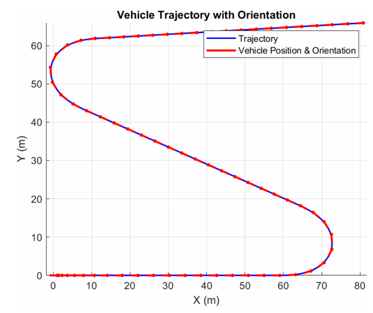
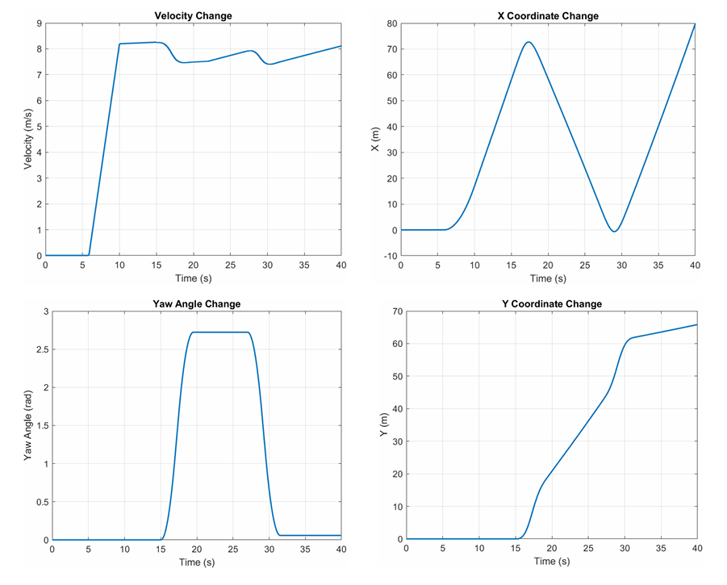
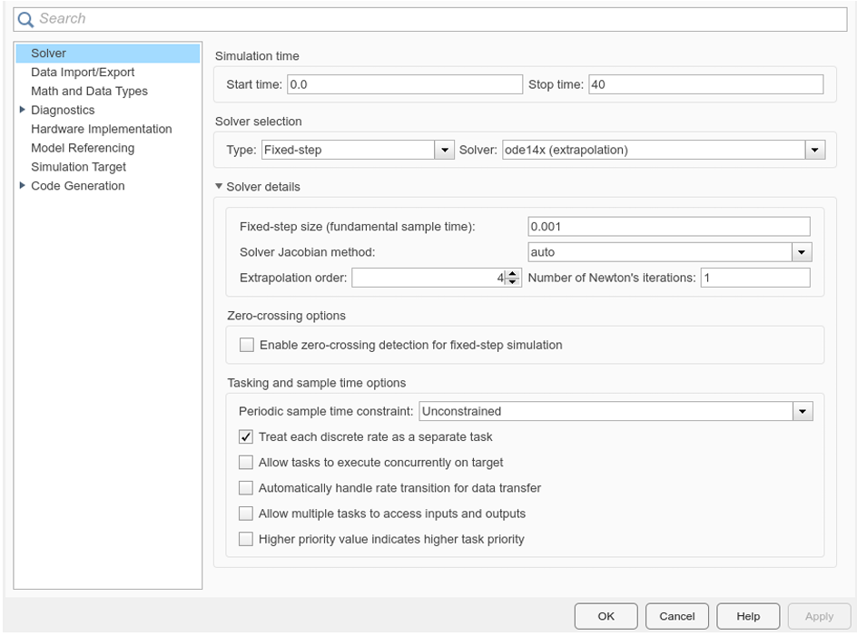

# Simulink-Based Vehicle Dynamics Simulation
This repository contains a simulation project focused on modeling and analyzing the dynamics of a ground vehicle using MATLAB Simulink.

## Project Overview
The model is based on the bicycle model of vehicle dynamics and includes:
- Kinematic, longitudinal, and lateral dynamics
- Linear tire model for simulating lateral tire forces
- Inputs: steering angle (δf) and front axle torque (Tf)
- Outputs: vehicle position (X, Y) and orientation (Ψ)

## Repository Structure
- Simulink model (car_model2.slx)
- MATLAB parameter and input scripts
- MATLAB script for output plotting

## Usage
After cloning or downloading the repository:
- Run parameters.m to load the vehicle parameters.
- Execute sample_input.m to simulate the vehicle model.
- Use output_plotting.m to generate the output graphs.

The generated plots should resemble the following:

## Technical Details
For numerical stability, the following solver configurations are recommended:

